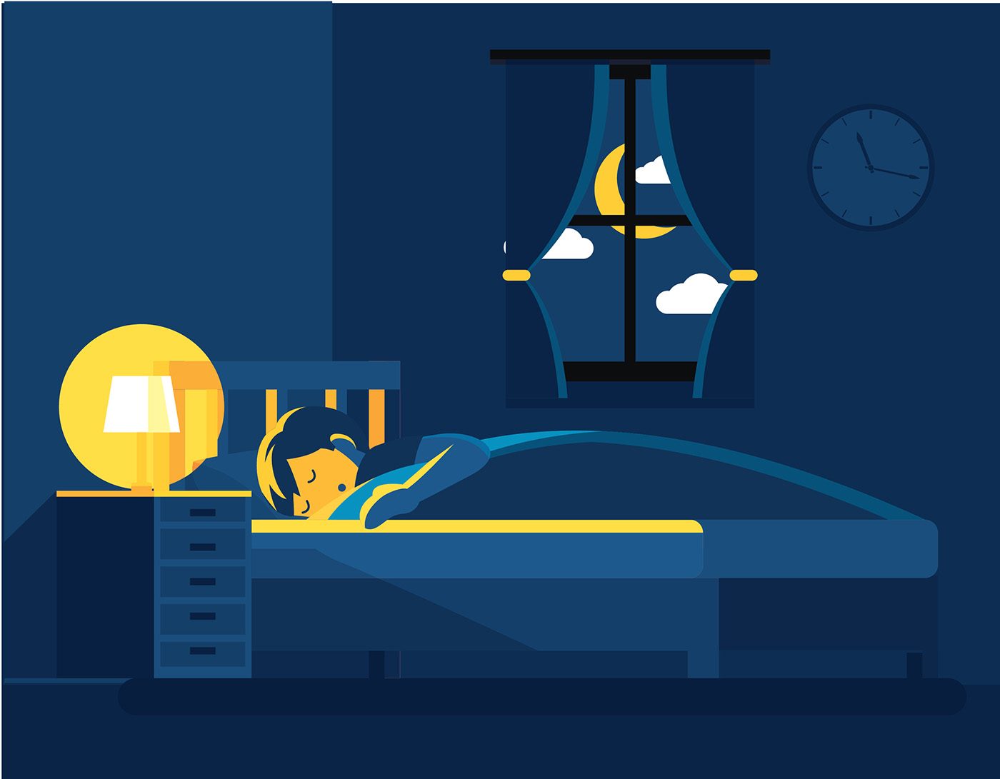

# UI

header.top{
    display: block;
    justify-content: space-evenly;
    margin-bottom: 2rem;
    
    
    li {
        float: right;

      }
    
    nav{
        
        
        margin-bottom: 2%;
        padding: 4%;
        
    }
        a{
                
                display: block;
                text-decoration: none;
                font-size: 2.3rem;
                color: white;
               
                
             
              }
               a:hover {
                background-color: white;
                color: black;
              }  
        }

        //padding-top: 6%;
    //padding-bottom: 3%;
    //padding-right: 0%;
    //flex-direction: column;
    //padding: 5%;
    //align-content: space-between;

html, body {
       font-family: 'IM Fell DW Pica', serif;
        background: #4E97CE;
        background: -moz-linear-gradient(top, #4E97CE 0%, #1C6EA4 50%, #080602 100%);
        background: -webkit-linear-gradient(top, #4E97CE 0%, #1C6EA4 50%, #080602 100%);
        background: linear-gradient(to bottom, #4E97CE 0%, #1C6EA4 50%, #080602 100%);
        background-repeat: no-repeat;
        color: #FFF;
        text-align: center;
  }

  .container {
    max-width: 800px;
    width: 100%;
    margin: 0 auto;
  }

  .first{
    height: 50%;
    width: 50%;
    opacity: 30%;
}
.firstcontent{
    display: flex;
    flex-direction: column;
    padding-top: 3%;
    padding: 10%;
    padding-bottom: 0%;
    font-family: 'Acme', sans-serif;
    
}

Button {
    color: rgb(255, 204, 103); font-size: 16px; line-height: 16px; padding: 8px; border-radius: 19px; font-family: Georgia, serif; font-weight: normal; text-decoration: none; font-style: normal; font-variant: normal; text-transform: none; background-image: linear-gradient(to right, rgb(28, 110, 164) 0%, rgb(35, 136, 203) 50%, rgb(20, 78, 117) 100%); box-shadow: rgb(0, 0, 0) 5px 5px 15px 5px; border: 2px solid rgb(28, 110, 164); display: inline-block;}
    .myButton:hover {
    background: #1C6EA4; }
    .myButton:active {
    background: #144E75; }

.second{
    opacity: 50%;
    height: 40%;
    width: 40%;
}
.secondcontent{
    display: flex;
    flex-direction: column;
    justify-content: space-around;
    padding: 10%;
    font-family: 'Acme', sans-serif;
}

header{
padding: 10%;

ul {
    list-style-type: none;
    margin: 0;
    padding: 0;
  }

li {
    float: right;
  }
  
  li a {
    display: block;
    color: white;
    text-align: center;
    padding: 14px 16px;
    text-decoration: none;
  }

}

padding-top: 3%;
    padding: 10%;
    padding-bottom: 0%;

    h1{
    justify-self: left;
   }

   

   .first{
    height: 5%;
    width: 40%;
    opacity: 10%;
    align-self: center;
}

